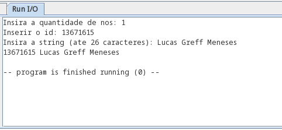
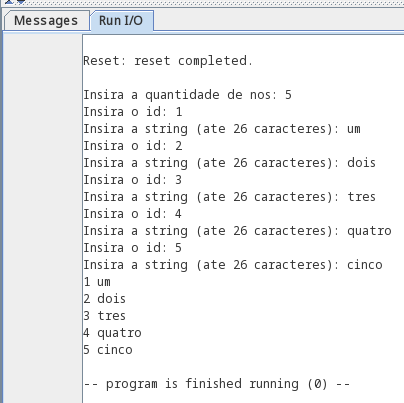
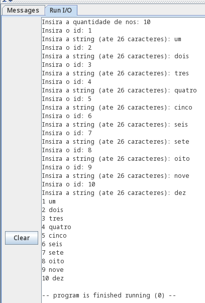

# SSC0902 – Organização e Arquitetura de Computadores
## Implementação de uma lista ligada em Assembly RISC-V

*Henrique Souza Marques - nUSP: 11815722* 
*Lucas Greff Meneses - nUSP: 13671615* 
*Eduardo Neves Gomes da Silva - nUSP: 13822710* 
*Vinicius Carneiro Macedo - nUSP: 11915752*  
*Instituto de Ciências Matemáticas e de Computação* 
*Universidade de São Paulo*

### Objetivo

- O objetivo deste trabalho é implementar em Assembly RISC-V uma lista ligada que armazenará duas informações: um ID (inteiro – 4 Bytes) e uma string de tamanho fixo (28 caracteres, ou 28 Bytes), totalizando uma estrutura de 32 Bytes. O programa deve criar a lista, solicitar ao usuário que forneça as informações para pelo menos 5 posições da lista, e depois percorrer a lista imprimindo esses elementos (uma posição da lista por linha).

### Descrição geral do programa:
- O programa recebe como input a quantidade de nós da lista e as informações de cada nó (ID e string). Ele aloca tais informações em uma lista simplesmente encadeada (apenas um ponteiro por nó) e imprime todos os elementos da lista, após a leitura.

**Legenda dos Registradores:**
- a0 - Parâmetro/Retorno do ecall
- a1 - Parâmetro do Syscall ReadString
- a2 - Endereço do último nó da lista
- a3 - Endereço do nó alocado pela função alocar_no
- a7 - Parâmetro do ecall

- s0 - Tamanho de um nó (36 bytes)
- s1 - Tamanho atual da lista (altera-se ao longo do programa)
- s2 - Quantidade total de nós da lista (constante ao longo do programa)
- s10 - Valor -1 (NULL) usado para ponteiros nulos.

**Estrutura do nó**

|byte    | Conteúdo|
|--------|---|
|0 - 3   | ID|
|4 - 31  | String com 28 bytes|
|32 - 35 | Ponteiro para o próximo nó (prox)|

### Descrição dos Casos Teste

**Caso Teste 1:**
- Inserindo apenas um elemento:   

- Após a inserção, o elemento é impresso ("13671615 Lucas Greff Meneses") 

**Caso Teste 2:**
- Inserindo cinco elementos:    

**Caso Teste 3:**
- Inserindo dez elementos:    

### Dificuldades Encontradas pelo grupo

- As dificuldades encontradas pelo grupo foram: determinar corretamente o papel de cada registrador no programa e saber diferenciar se um registrador está armazenando um valor ou um endereço de memória ao longo do programa.
